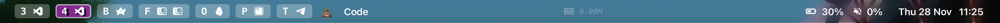

# A simple sketchybar config for aerospace users!

I couldn't find any resources for a simple sketchybar config that worked with aerospace. So this is what I came up with!

[Here's my how current configuration looks](https://github.com/Kainoa-h/MacSetup)

## Credits:
I'm kinda new to shell scripting and all this stuff.
Here are the resources that helped me make this config besides the official [sketchybar](https://felixkratz.github.io/SketchyBar/config/bar) and [aerospace](https://nikitabobko.github.io/AeroSpace/guide) docs :p

 - [This github user's wayyyy more advanced sketchybar & aerospace setup](https://github.com/forteleaf/sketkchybar-with-aerospace)
 - [Josean Martinez's amazing guide for setting up sketchybar with yabai](https://www.josean.com/posts/sketchybar-setup)

## Aerospace:
### Getting it working:

If you already have an aerospace config or don't want to use mine, add the following into your `aerospace.toml` to trigger sketchybar & pass workspace data.
``` Shell
exec-on-workspace-change = ['/bin/bash', '-c',
    'sketchybar --trigger aerospace_workspace_change FOCUSED_WORKSPACE=$AEROSPACE_FOCUSED_WORKSPACE PREV_WORKSPACE=$AEROSPACE_PREV_WORKSPACE'
]
```
_do note that `'sketchybar --trigger aerospace_workspace_change FOCUSED_WORKSPACE=$AEROSPACE_FOCUSED_WORKSPACE PREV_WORKSPACE=$AEROSPACE_PREV_WORKSPACE'` should be on a single line._


## Sketchybar
### Current Functionality:
 - Dynamically displays/hides active/inactive workspaces. (not working perfectly...)
 - Displays apps in each workspace
 - Displays total swap memory (updates every 20 seconds)

### Getting it working:
You will need to install a Nerd Font if you haven't already!
``` Shell
brew tap homebrew/cask-fonts
brew install font-hack-nerd-font
```

jq as well!
``` Shell
brew install jq
```

I used the SF font in my config so let's install that too! If you don't want to, that's fine as well. Just remeber to change the fonts used in `sketchybarrc`
```
brew install font-sf-pro
```

Lastly, you'll want to grab the [sketchybar app font](https://github.com/kvndrsslr/sketchybar-app-font/releases) and add it to your '~/Library/Fonts/' directory!
